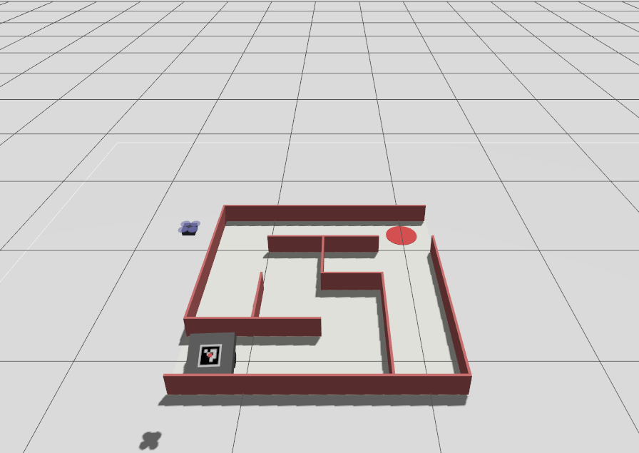
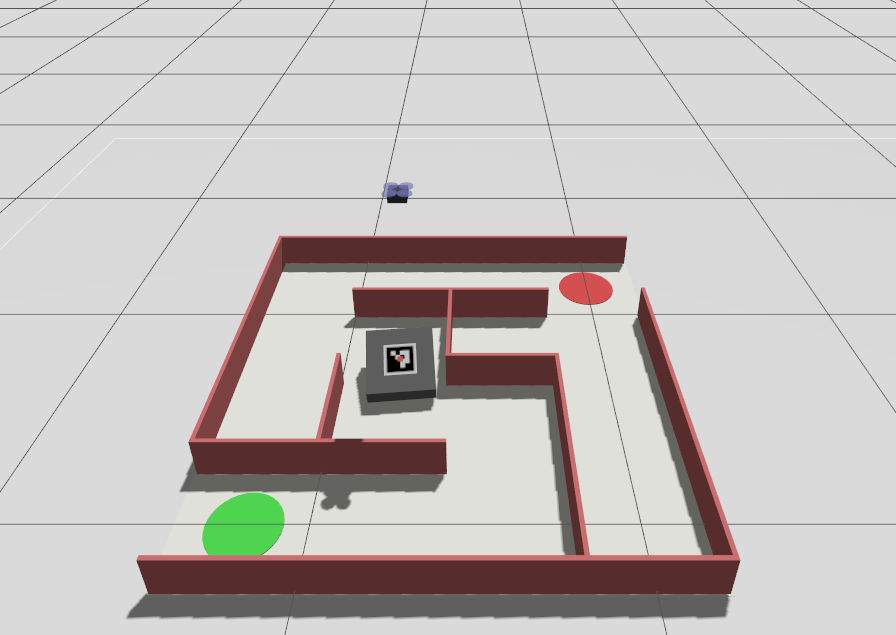
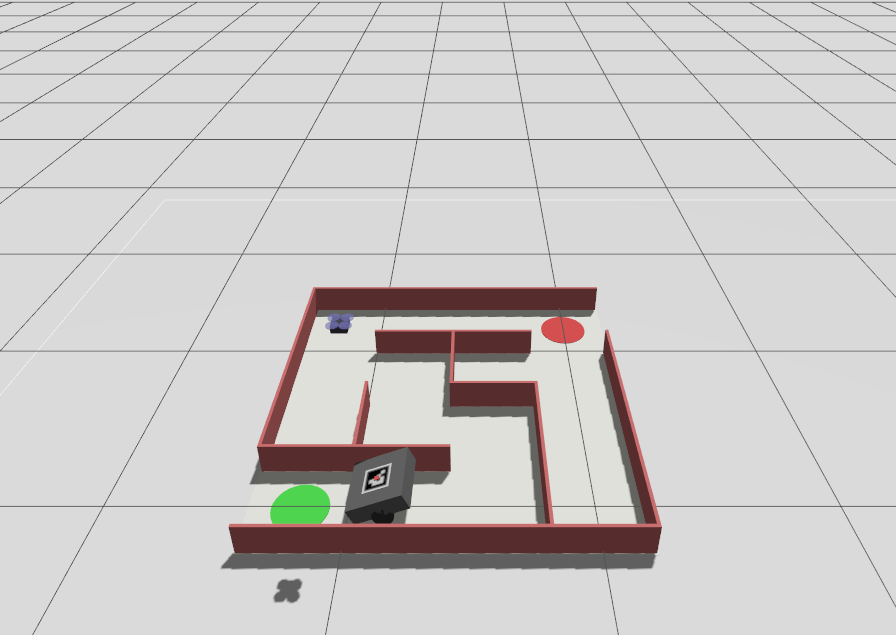

<div align="center">

# maze-robot-drone-sim

### Gazebo Harmonic + ROS 2 Jazzy — Autonomous Maze Navigation with ArUco Drone Tracking

[](https://docs.ros.org/en/jazzy/)
[](https://gazebosim.org/)
[](https://www.python.org/)
[](https://opencv.org/)
[](LICENSE)

</div>

---

## Simulation en action

| Phase 1 — Démarrage & Décollage | Phase 2 — Navigation du Robot |
|:---:|:---:|
|  |  |
| Le drone décolle au-dessus du robot | Le robot commence sa navigation A* |

| Phase 3 — Suivi ArUco (Tracking) | Phase 4 — Arrivée au Goal |
|:---:|:---:|
|  |  |
| Le drone suit le robot via sa caméra | Le robot atteint le goal (🔴) et le drone atterrit |

> **Vert** = Start · **Rouge** = Goal · **Petit cube bleu** = Drone Crazyflie · **Robot gris** = Robot différentiel avec marqueur ArUco

---

## Vue d'ensemble

Ce projet simule un **robot mobile différentiel** naviguant de manière autonome dans un labyrinthe généré procéduralement, suivi en temps réel par un **drone Crazyflie** équipé d'une caméra orientée vers le bas.

### Fonctionnalités clés

| Feature | Description |
|---|---|
|  **Génération de labyrinthe** | DFS randomisé → monde SDF + chemin A* en JSON |
|  **Navigation autonome** | Contrôleur go-to-goal avec auto-calibration odométrique |
|  **Drone de suivi** | Machine à états TAKEOFF → HOVER → TRACKING → LANDING |
|  **Vision par ordinateur** | Asservissement visuel ArUco ID 0 (DICT_4X4_50) temps réel |
|  **Communication ROS 2** | Topics inter-noeuds via `/maze_navigator/status` |

---

##  Architecture

```
maze_robot_sim/
├── maze_robot_sim/
│   ├── maze_world_generator.py   # Génération SDF + solution A*
│   ├── maze_navigator_node.py    # Navigation A* + auto-calibration
│   └── drone_mapper_node.py      # Machine à états drone + ArUco tracking
├── description/
│   ├── robot_core.xacro          # Robot différentiel + ArUco marker
│   ├── robot_ros2_control.xacro  # Interface ros2_control
│   ├── crazyflie_model.sdf       # Modèle SDF du drone Crazyflie
│   └── crazyflie.urdf.xacro      # URDF du drone
├── launch/
│   └── maze_sim.launch.py        # Launch principal
├── config/
│   └── diff_drive_controller.yaml
├── worlds/                       # Monde SDF généré automatiquement
├── media/                        # Captures d'écran de la simulation
└── run_sim.sh                    # Script de lancement simplifié
```

---

## ⚙️ Comment ça fonctionne

### Architecture modulaire : Indépendant vs Coopératif

```
┌──────────────────────────────────────────────────────────────┐
│  INDÉPENDANT                                                  │
│  ┌─────────────────────┐   ┌──────────────────────────────┐  │
│  │  maze_world_generator│   │   maze_navigator_node         │  │
│  │  DFS + A* → SDF+JSON│   │   Lit chemin A* → suit WP     │  │
│  │  (no ROS, no Gazebo) │   │   Aveugle au drone            │  │
│  └─────────────────────┘   └──────────────────────────────┘  │
└──────────────────────────────────────────────────────────────┘

┌──────────────────────────────────────────────────────────────┐
│  COOPÉRATIF (via ROS 2)                                       │
│                                                               │
│  Robot  ──► /maze_navigator/status ──► Drone                 │
│    │              GOAL_REACHED               │                │
│    │                                    ▼   │                │
│    └──── ArUco marker ◄── camera ─── LANDING│                │
│                   (asservissement visuel)                     │
└──────────────────────────────────────────────────────────────┘
```

### Séquence complète d'une simulation

```
① Génération : Labyrinthe aléatoire (DFS) → SDF + chemin A* (JSON)
② Spawn      : Robot au start · Drone au-dessus du robot (z=1m)
③ Calibration: Micro-rotation du robot → détection auto convention angulaire
④ Takeoff    : Drone monte à 1m d'altitude (feedback altitude réelle Gazebo)
⑤ Hover Map  : Drone stationnaire 3s au-dessus du labyrinthe
⑥ Tracking   : Robot navigue A* · Drone suit via ArUco (P-controller 30Hz)
⑦ Goal       : Robot publie GOAL_REACHED · Drone déclenche LANDING
⑧ Landing    : Descente progressive avec centrage ArUco · Moteurs stop
```

### Comment fonctionne le suivi visuel (Visual Servoing)

Le drone utilise un **asservissement visuel en boucle fermée** :

```
Image caméra (top-down)
        │
        ▼
cv2.aruco.ArucoDetector  →  centre marqueur (cx, cy)
        │
        ▼
Erreur normalisée [-1, 1]² :
  ex = (cx - W/2) / (W/2)   → décalage horizontal
  ey = (cy - H/2) / (H/2)   → décalage vertical
        │
        ▼
Contrôle proportionnel :
  vx = clip(kp_xy × ey, ±max_xy)   → avance/recule
  vy = clip(kp_xy × ex, ±max_xy)   → glisse gauche/droite
  vz = clip(kp_alt × alt_err, ±max_alt) avec deadband ±0.1m
```

---

##  Prérequis

**Système : Ubuntu 24.04 · ROS 2 Jazzy · Gazebo Harmonic**

```bash
sudo apt update && sudo apt install -y \
  ros-jazzy-desktop \
  ros-jazzy-ros-gz \
  ros-jazzy-ros-gz-sim \
  ros-jazzy-ros-gz-bridge \
  ros-jazzy-gz-ros2-control \
  ros-jazzy-ros2-control \
  ros-jazzy-ros2-controllers \
  ros-jazzy-controller-manager \
  ros-jazzy-joint-state-broadcaster \
  ros-jazzy-diff-drive-controller \
  ros-jazzy-robot-state-publisher \
  ros-jazzy-xacro \
  ros-jazzy-tf-transformations \
  ros-jazzy-cv-bridge \
  python3-transforms3d \
  python3-opencv
```

> Si les dictionnaires ArUco ne sont pas inclus dans votre opencv : `pip install opencv-contrib-python`

---

## Lancer la simulation

### 1. Build

```bash
cd maze_robot_sim
source /opt/ros/jazzy/setup.bash
colcon build --symlink-install
source install/setup.bash
```

### 2. Lancer

**Robot seul :**
```bash
./run_sim.sh
```

**Robot + Drone Crazyflie :**
```bash
./run_sim.sh spawn_drone:=true
```

**Avec un labyrinthe fixe (seed) :**
```bash
./run_sim.sh spawn_drone:=true seed:=42 rows:=5 cols:=5
```

### Arguments disponibles

| Argument | Défaut | Description |
|---|---|---|
| `rows` | `4` | Nombre de lignes du labyrinthe |
| `cols` | `4` | Nombre de colonnes du labyrinthe |
| `cell_size` | `0.4` | Taille d'une cellule en mètres |
| `seed` | aléatoire | Graine pour reproduire un labyrinthe |
| `spawn_drone` | `true` | Activer le drone Crazyflie |
| `invert_angular` | `""` | Forcer l'inversion angulaire (`true`/`false`/auto) |

---

## 📡 Topics ROS 2

### Robot au sol (`maze_navigator_node`)

| Topic | Type | Direction | Description |
|---|---|---|---|
| `/diff_drive_controller/odom` | `nav_msgs/Odometry` | ← Sub | Odométrie roues |
| `/diff_drive_controller/cmd_vel` | `geometry_msgs/TwistStamped` | → Pub | Commande vitesse |
| `/maze_navigator/status` | `std_msgs/String` | → Pub | `CALIBRATING` / `WAYPOINT_i/N` / `GOAL_REACHED` |
| `/imu` | `sensor_msgs/Imu` | ← Sub | IMU (souscrit, non utilisé activement) |

### Drone Crazyflie (`drone_mapper_node`)

| Topic | Type | Direction | Description |
|---|---|---|---|
| `/drone/camera/image_raw` | `sensor_msgs/Image` | ← Sub | Flux caméra top-down |
| `/model/crazyflie/pose` | `geometry_msgs/Pose` | ← Sub | Altitude réelle Gazebo |
| `/crazyflie/cmd_vel` | `geometry_msgs/Twist` | → Pub | Commandes vitesse drone |
| `/crazyflie/enable` | `std_msgs/Bool` | → Pub | Enable moteurs |
| `/drone/mapper/status` | `std_msgs/String` | → Pub | `TAKEOFF` / `TRACKING` / `LANDING` / `DONE` |
| `/maze_navigator/status` | `std_msgs/String` | ← Sub | Signal GOAL_REACHED |

---

## 🔧 Paramètres de navigation

### `maze_navigator_node`

| Paramètre | Défaut | Description |
|---|---|---|
| `linear_kp` | `0.9` | Gain proportionnel vitesse linéaire |
| `angular_kp` | `1.8` | Gain proportionnel vitesse angulaire |
| `max_linear_speed` | `0.3 m/s` | Vitesse max en ligne droite |
| `max_angular_speed` | `1.6 rad/s` | Vitesse angulaire max |
| `goal_tolerance` | `0.05 m` | Rayon d'acceptation d'un waypoint |
| `align_tolerance_rad` | `0.35 rad` | Seuil d'alignement avant avance |

### `drone_mapper_node`

| Paramètre | Défaut | Description |
|---|---|---|
| `takeoff_altitude` | `1.0 m` | Altitude de décollage |
| `tracking_altitude` | `0.8 m` | Altitude de suivi |
| `landing_altitude` | `0.12 m` | Altitude d'atterrissage |
| `linear_gain_xy` | `0.5` | Gain P asservissement XY |
| `max_xy_speed` | `0.2 m/s` | Vitesse max XY du drone |
| `mapping_hover_sec` | `3.0 s` | Durée du survol initial |

---

## 🤖 Modèles physiques

### Robot différentiel (`maze_robot`)
- Dimensions : **0.25 m × 0.25 m × 0.08 m**
- Entraînement : `diff_drive_controller` via `ros2_control`
- Capteurs : IMU + encodeurs de roues (`/joint_states`)
- Marqueur : ArUco ID 0 (`DICT_4X4_50`) sur le toit

### Drone Crazyflie
- Modèle quadricoptère équivalent Crazyflie 2.x
- Vol contrôlé via `gz-sim-velocity-control-system`
- Caméra orientée vers le bas (pitch=90°, yaw=180°)
- Résolution caméra : 320×240 px @ 30 Hz

---

## Fichiers générés automatiquement

À chaque lancement, le script de génération produit dans `worlds/` :
- `generated_maze.sdf` — Monde Gazebo (murs, sol, marqueurs start/goal)
- `generated_maze.json` — Métadonnées (grille bitmask, chemin A*, dimensions)

---

## 🛠️ Dépannage

**Le robot ne bouge pas :**
```bash
ros2 topic info /diff_drive_controller/odom --verbose
# → Publisher count doit être 1
```

**Le drone ne décolle pas :**
```bash
ros2 topic echo /model/crazyflie/pose
# → Doit afficher la position z du drone
```

**ArUco non détecté :**
```bash
ros2 topic echo /drone/camera/image_raw --no-arr
# → Vérifier que le topic publie bien des images
```

---

## 📄 Licence

MIT © 2026 — yassinechouk
